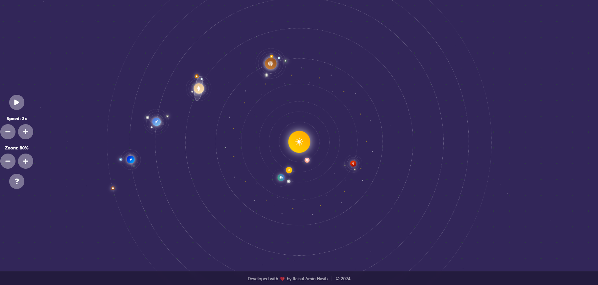

# Interactive Solar System

  
  
  

    A fun and educational interactive solar system visualization built with React, TypeScript, and Framer Motion.
     
    <a href="https://solar-system-one-pied.vercel.app/">View Live Demo</a>
    ·
    <a href="https://github.com/RaHasib/SolarSystem/issues">Report Bug</a>
    ·
    <a href="https://github.com/RaHasib/SolarSystem/issues">Request Feature</a>
  

## Features

- Interactive planets with real facts
- Smooth animations and transitions
- Detailed information panel
- Realistic orbital movements
- Fun and educational content

## Technologies Used

- React
- TypeScript
- Chakra UI
- Framer Motion
- React Icons
- Zustand

## Getting Started

1. Clone the repository
2. Install dependencies: `npm install`
3. Start the development server: `npm run dev`
4. Open http://localhost:3000

4. **Open your browser**
Navigate to `http://localhost:3000`

## 🎮 Controls

- **Zoom**: Use + and - buttons to adjust view
- **Speed**: Control animation speed (1x-3x)
- **Play/Pause**: Toggle planet animations
- **Planet Selection**: Click any celestial body for details
- **Help**: Access the help menu for more information

## 🌟 Featured Celestial Bodies

- **Sun**: Our star with dynamic glow effects
- **Planets**: 
  - Mercury
  - Venus
  - Earth (with Moon system)
  - Mars
  - Jupiter
  - Saturn
  - Uranus
  - Neptune
  - Pluto
- **Moons**: Earth's Moon with realistic orbit

## 🎨 Design Features

- Realistic planet gradients
- Dynamic animations
- Interactive UI elements
- Space-themed background
- Responsive layout for all devices

## 🔧 Configuration

Customize the solar system by modifying `planetStore.ts`:
- Planet properties
- Orbital characteristics
- Visual styling
- Factual information

## 🤝 Contributing

Contributions are welcome! Please feel free to submit a Pull Request.

1. Fork the repository
2. Create your feature branch (`git checkout -b feature/AmazingFeature`)
3. Commit your changes (`git commit -m 'Add some AmazingFeature'`)
4. Push to the branch (`git push origin feature/AmazingFeature`)
5. Open a Pull Request

## 📝 License

This project is licensed under the MIT License.

## 🙏 Acknowledgments

- Planet data and facts from NASA
- Icons provided by React Icons
- UI components from Chakra UI
- Animation system by Framer Motion

---

Made with ❤️ for space exploration enthusiasts
